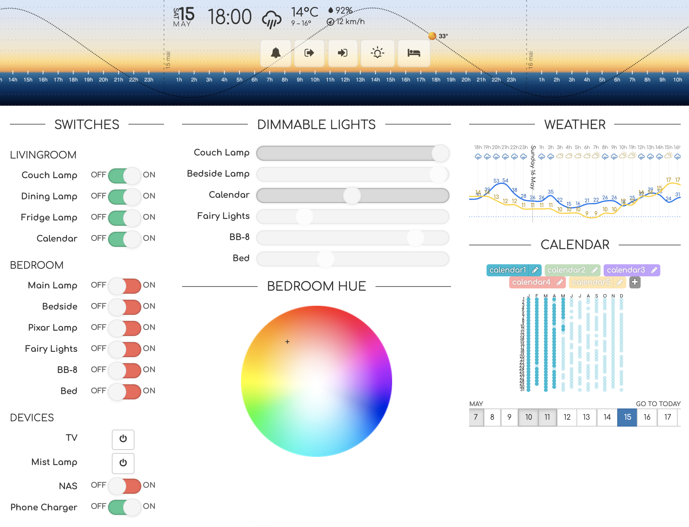
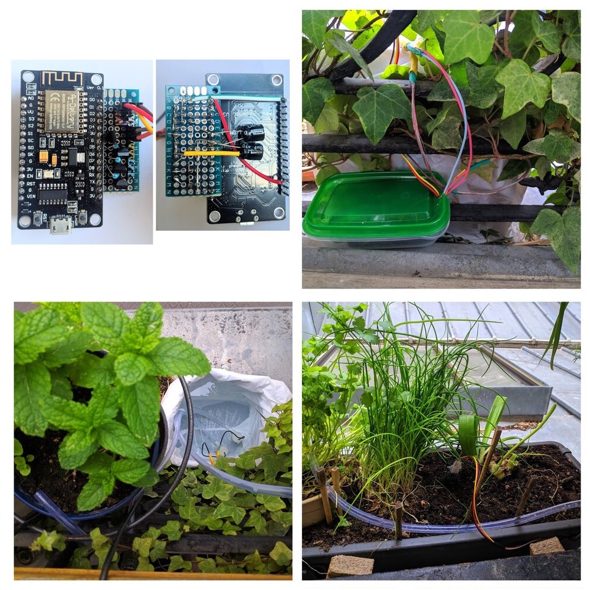
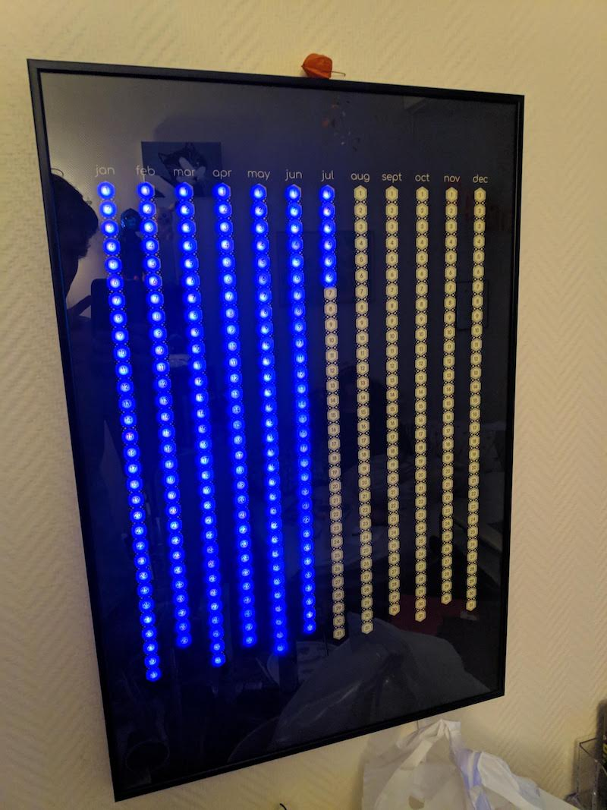
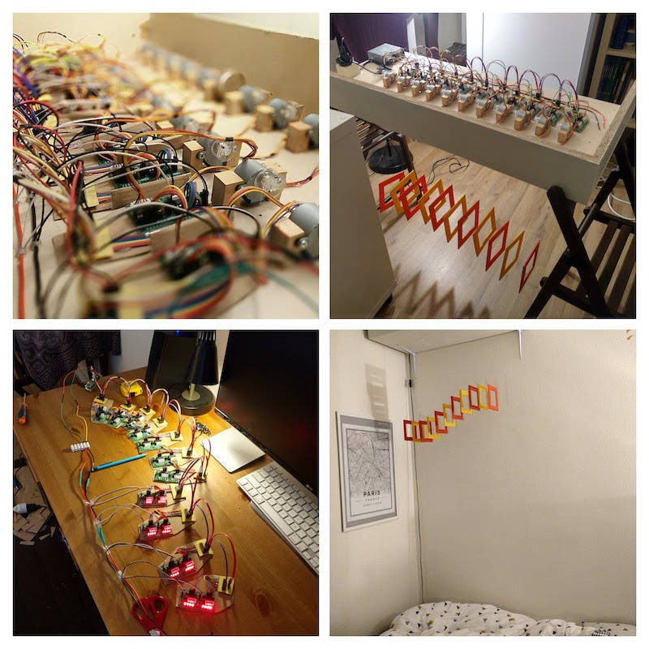

# Smart home server

This repository contains the code for my small and personal home automation project.

It contains the following subprojets with details in the linked READMEs:

* [`smarthome-server`](smarthome-server/README.md): main folder with the code of the server that handles the smart-home project


* [`esp8266-watering`](esp8266-watering/README.md): an ESP8266 handling watering of my plants 


* [`everyday-calendar`](everyday-calendar/README.md): code for the small server that handles my version of the Everyday Calendar


* [`crespin-mobile`](crespin-mobile/README.md): code for an [Elias Crespin](http://www.eliascrespin.net/) inspired motorized suspended decoration


* `esp8266-ac-dimmer`: code for the ESP8266 that handles the dimming of an 230V LED bulb from IKEA
   based on a [Robodyn Dimmer](https://github.com/RobotDynOfficial/RBDDimmer)


### Dev notes

Code should be YAPF'ified and isort'ed. A pre-commit hook should be installed
to ensure it, using :

```bash
find .git/hooks -type l -exec rm {} \;
find .githooks -type f -exec ln -sf ../../{} .git/hooks/ \;
```
