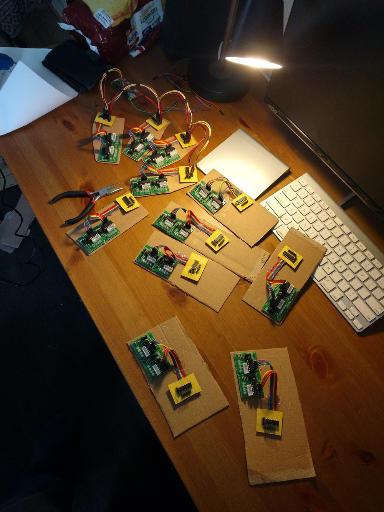

This code is designed to power an Elias Crespin inspired mobile. It
[looks like this](http://www.eliascrespin.net/en/exhibition/lumiere-et-mouvement/). The electronics
side of this project consists in controlling many motors. Since I wanted to control the behavior of
this device via wifi, it is controled by a Raspberry Pi Zero W. I think now I would use an ESP8266
instead for simpler real time management.

# Images of the project

Assembly of ULN2003 and 74HC595 motor control and first test

First POC

Full assembly on a wood board

Final install on the wall

# Parts list

## Power

* 220V power cable + electric plug (to power 5V USB adapter for raspberry)
* Power supply (depends on the chosen option, 5V or 9/12V)
* Electric cabling for motors

## Electronics

* Raspberry Pi
* Motors (28BYJ-48) + control (ULN 2003 + 74HC595)
* Wiring cables

## Hardware

* Wood board for the structure
* Bobbin to roll wire using sewing machine spools
* Nylon cable
* Foam board + paint for the suspended items
* Shelf bracket

# Motors: 28BYJ-48

For better control of the rotation, using stepper motors for which you control each time it goes
from one step to the next in both directions.

Since I wanted to keep the budget small, and require lots of motors, I used 28BYJ-48 (~1.3€ each).

## Theortical specs

* 5V or 12V
* ~100mA / 0.5W
* 1/64 reduction ratio
* 64 steps / internal revolution (half-step mode)
* 4096 steps / external revolution (half-step mode)
* Can be made bipolar (req for A4988): 10V or 24V, more torque
* **Torque tests:** https://grahamwideman.wikispaces.com/Motors-+28BYJ-48+Stepper+motor+notes

## Tests for drivers

|             | ULN 2003 (half-step)    | A4988          |
|:------------|:------------------------|:---------------|
| Torque test | > 180g, 1.5-2 cm pulley | same           |
| Speed       | > 0.7ms / step          | > 0.2ms / step |
| Current     | < 300mA                 | -              |
| Resistance  | 26-41 Ω                 |                |

# Motors control

We need to control lots of motors and send commands to them very fast, which is not that simple to
do. I settled up on the following.

## Computation unit: Raspberry Pi

* **GPIO outputs usable to control motors:** 26 max (GPIO 0-1 reserved, 2-27 free)
* **GPIO frequency:** 28-70 kHz (python), 4-20 MHz (C) <=> 14-35µs, 50-250ns
  (possibly too slow in python with computation, should be ok in C)
  http://codeandlife.com/2012/07/03/benchmarking-raspberry-pi-gpio-speed/
* **Direct GPIO extensions:** I2C modules: > 10€ and risk of communication slowdown

## Option 1: ULN 2003 + 74HC595 (~ free)

* (+)  Cheap
* (+)  Simple and flexible
* (-)  Manual control, no particular feature
* (--) No power control
* ( )  Full or half-stepping
* ( )  Requires 4 pins, too many to drive numerous motors, i.e. need to use 74HC595 shift registry
* (~)  Steps are made at the same time for all motors since on shift registry, not great to handle different speed, probably not big deal though considering the size of the steps

* **Direct connection: 6 motors**
* **74HC595 connection: ∞ motors**
    * 3 inputs, 8+ outputs (can be chained)
    * 40-100 ns delay between input data (suppose 0.1µs for margin)
    * To address 10 motors, req 40 outputs: 5 ships, 4µs forward data delay << 0.7ms motor rotation delay (OK)

# Option 2: A4988 driver (~ 0.90€ / motor)

https://www.pololu.com/file/download/A4988.pdf?file_id=0J450

* (++) Simpler
* (+)  Power supply management
* (+?) Micro-stepping
* ( )  Requires 2 pins: step & direction (possibly use 74HC595)
* (+)  Sleep mode
* ( )  2µs per step min << 0.7ms motor rotation delay (OK)
* (~)  Requires to change the motors to bipolar
* (+)  Independent motor control (nice if ≠ speeds)
* ( )  Possible hybrid use of 74HC595, e.g. only for direction which changes rarely compared to steps
* (--) more expensive

* **Direct connection: 12-13 motors**
    * 26 GPIOs => 13 motors max, 12 if SLEEP usage
* **74HC595 for direction only: 22 motors**
    * 3 GPIOs for DIR through 74HC595
    * 1 GPIO for SLEEP
    * 22 GPIOs for STEP
    * Different STEP frequency still possible
* **74HC595 for direction & step: ∞ motors**
