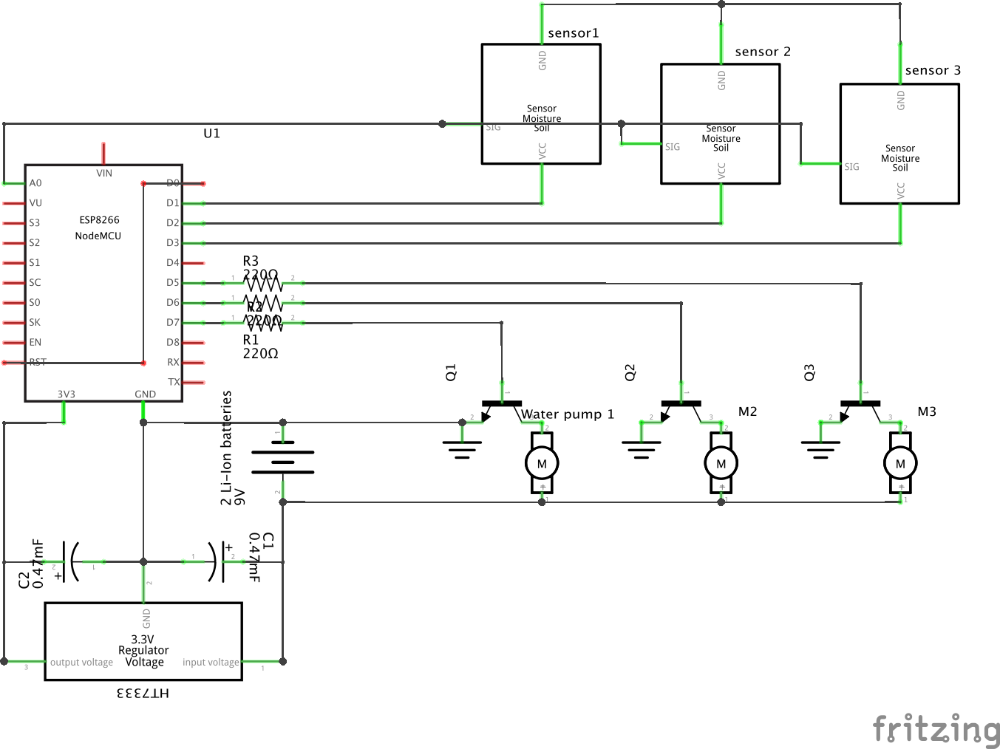
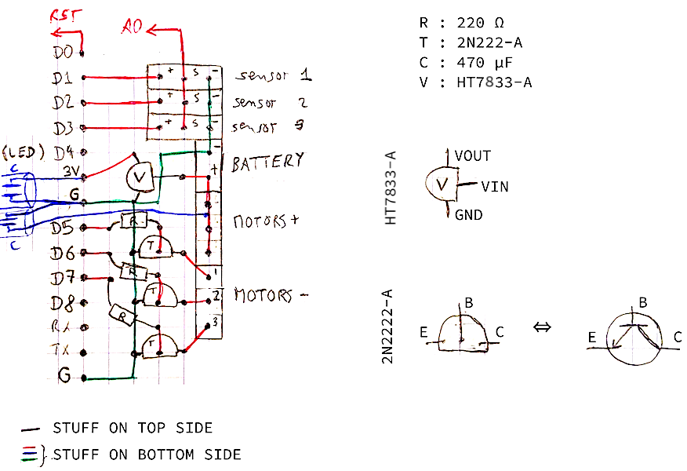
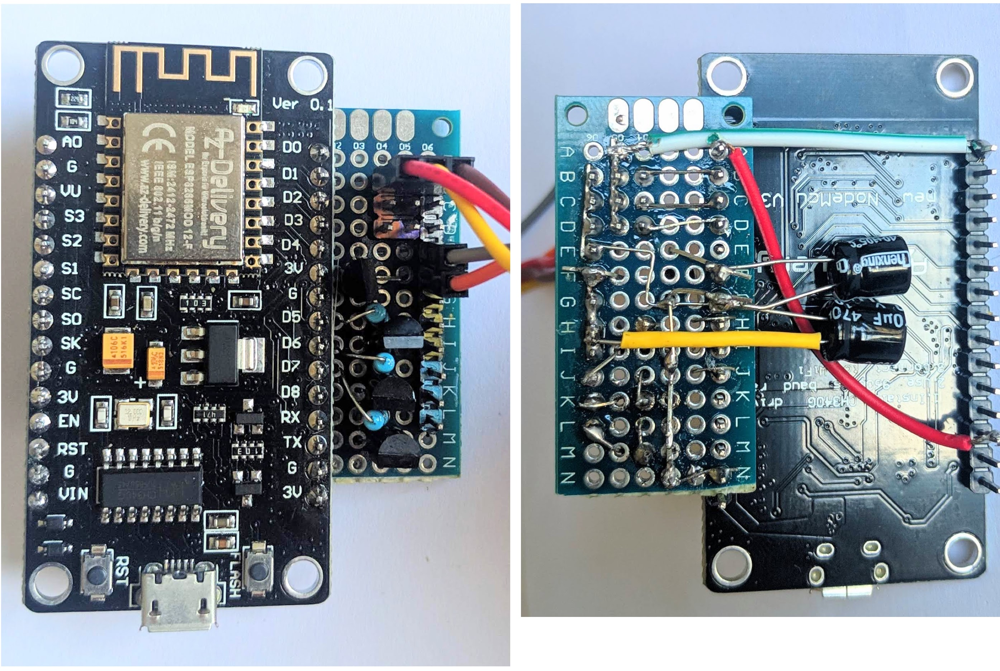
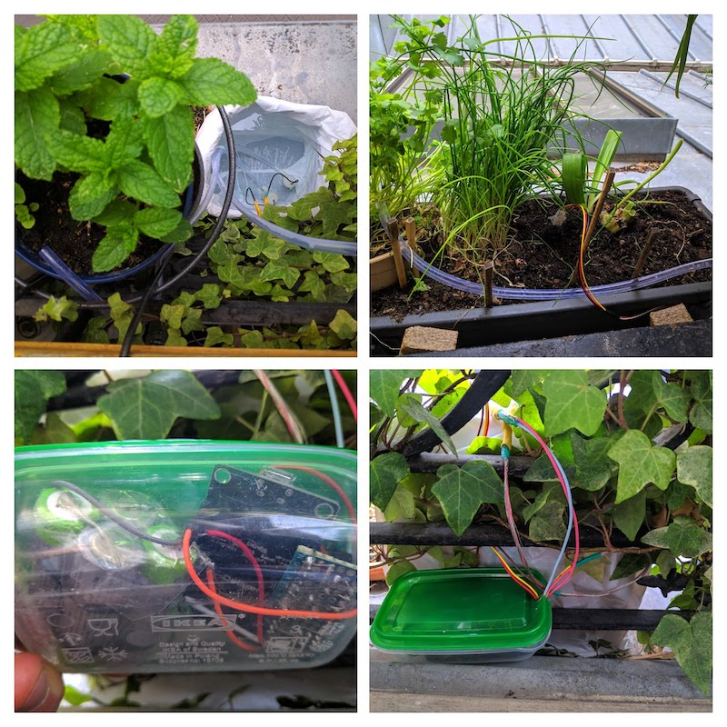

# Homemade watering system

The goal of this project is to be able to automatically water small plant pots
from a standing water reserve (i.e. without a pressured water tap) and without
a mains power supply.

One device can measure the moisture and water up to 3 pots.

For this, I use:

* an ESP8266 chip for control and wifi communication to get watering rules (cf
  `smarthome-server/smarthome/watering`)
* a pack of batteries (initially 4×1.2V NiMH batteries, now 2×4.2V li-ion batteries)
* an [HT7833 voltage regulator](HT78xx.pdf) to very efficiently (~4mA loss) power the
  ESP with a 3.3V source. An [HT7333](HT73xx.pdf) can also be used but has less max
  power output which might be a problem with ESP8266. In practice, it seems to work.
* soil moisture sensors in parallel all plugged into the analog read of the ESP, with
  only one powered (from ESP output pin) at any time to be able to read all of them.
* small water pumps powered directly from the battery pack and controlled by ESP
  output pins with a 2N2222 transistor.

In the `src` folder you will find the code that is used to program the ESP8266.
It needs to be able to call the watering API of the `smarthome-server` project.

### Schematics and real build

The schematics of this project is quite simple:

All this is build with a PCB-like board soldered on the right side of the
NodeMCU ESP8266 dev board following this compact and wierd design:

In real life, the PCB looks like this:

And the device put in place:

### Notes about power

Initially, I used 4×1.2V NiMH batteries, giving a voltage of ~5V.

I recently reclaimed 18650 Li-ion batteries from very-old-laptop batteries. The
watering devices are now powered with 2×3.7V Li-ion batteries.

Those batteries are regularly recharged using an external
[XTAR VC4S charger](https://www.xtar.cc/product/XTAR-VC4S-Charger-112.html) that
managed to bring back the old batteries, initially showing 0V, back to life. They
are stored in a battery case. To avoid any over-current or over-discharge (not sure
if it's a real threat), the battery case is interfaced with a [2S BMS](2S_BMS.jpg).
Note that for some BMS I had to "kickstart" them by puting 8.2V on the P+/P- pins.
Without that it were not outputting any voltage. It simply did that with another
battery pack that provided the 8.2V. I applied it for a few seconds and it did the trick.
[I found this solution here.](https://www.reddit.com/r/batteries/comments/b41me8/not_sure_whats_wrong_here2s_bms/).

Because the average voltage of the battery pack is now around 7.4V which is now
much higher that the 5V of the motors. Since the motors are directly powered by
the batteries, the "solution" to avoid having to go through a voltage regulator
is to use PWM so that the average voltage seen by the motor is lower than 7.4V.
This is set using the constant `motorPWM`.

I also noticed that fully charged, the 8.2V of the 2 batteries tops the 8V max
VIn limit of the HT7833 3.3V LDO. Wierdly the HT7333 allows 12V. It did not fry
a HT7833 for now.
