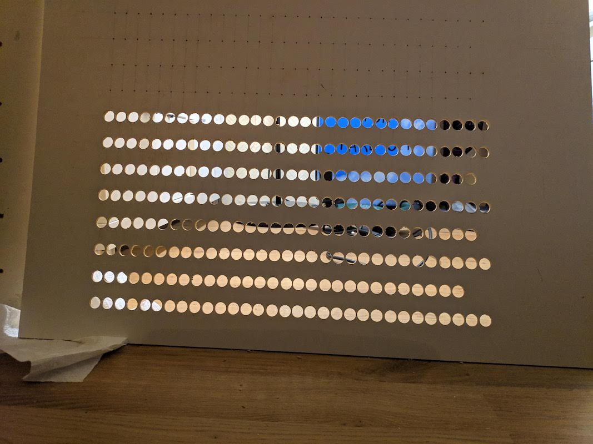
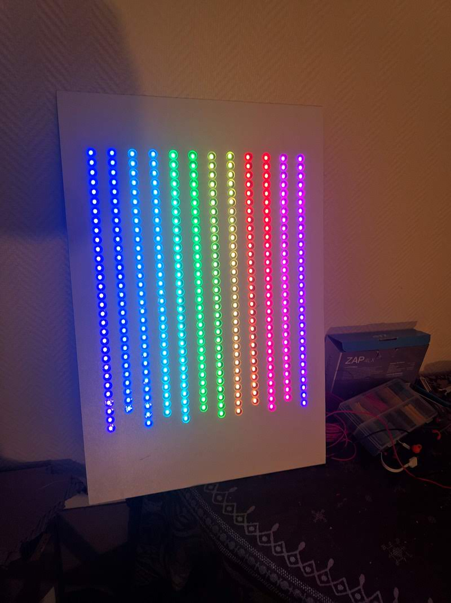

# Smart calendar

This project is inspired by [Simone Giertz's Everyday Calendar](https://www.simonegiertz.com/every-day-calendar).
This is my take on this with a much lower budget and slightly different features.

This calendar is built with:

* A poster frame with glass window
* A paper printed calendar with all days in a year
* A thin MDF board with 365 holes aligned with the calendar
* An RGB indexable LED ribbon with 1 LED in each hole of the board
* A Raspberry Pi Zero W to control the LEDs

The Raspberry Pi will need to run the server code in this folder. This code will
expose routes to interract with the calendar:

* tick/untick a day
* set the currently viewed calendar
* set the brightness of the calendar

To interract with this calendar, I personnaly use the front UI of the
[smarthome-server](../smarthome-server/README.md) project which includes interractions
with this server. This UI is always directly on an old smartphone in my living room.

Compared to Simone's calendar, you cannot physically interract with the calendar,
you need to call the API somehow. However, you can have multiple calendars each with a
different color.

### Some photos of the build

MDF board with holes, work in progress

MDF board finished, LED ribbon installed and being tested

Final calendar

### Ideas for the future

* Show multiple calendars at once
* Iterate on the different calendars each _X_ minutes
* Connect to Google Calendar to show your real calendar visually
