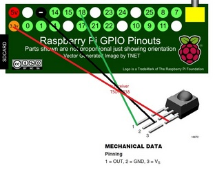

# Smart home server

This is a custom home automation project. This folder contains the code for the
web server at the center of this project. It also relies on other softwares
and various devices, as described in this first section.

## Devices controled

* Power Plugs with RF Remote (433 MHz)
* Philips Hue Lights
* ESP8266 LED lights (custom)
* ESP8266 230V dimmer (custom)
* ESP8266 plants watering (custom)
* [Elias Crespin-inspired motorized suspended decoration](http://www.eliascrespin.net/) w/ Pi-zero-W (custom)
* [Everyday Calendar inspired by Simone Giertz](https://www.simonegiertz.com/every-day-calendar) w/ Pi-zero-W (custom)
* Devices with infrared remote (TV & essential oil diffuser)
* NAS via soldering on the power-on switch (custom)

## Sensors

* Temperature sensor (DHT11)
* **TODO** Motion sensor (PIR)


## Overall architecture

This project handles interractions between different elements. Here is an overview
of the network **[N]** / software **[S]** / hardware **[H]** architecture:

* **[N]** 192.168.1.10 : Central Raspberry PI v3 server
  * **[S]** Nginx exposing:
    * `smarthome-server/webui` on `/` (frontend of `smarthome-server`)
    * `localhost:5000` on `/api` (backend of `smarthome-server` with FastAPI)
    * `192.168.1.20:5000` on `/calendar` (redirection to the smart calendar)
    * `http://192.168.1.3/api/<token>` on `/hue` (redirection to the HUE bridge with token)
  * **[S]** lirc to send queries to:
      * **[H]** IR LEDs (VS1838B) in front of relevant devices
  * **[H]** 433 MHz RF transitting chip
  * **[H]** wires soldered to my NAS power-switch button to start/stop it
  * **[H]** temperature sensor

* **[N]** 192.168.1.2 : NAS

* **[N]** 192.168.1.3 : Hue Bridge to communicate with:
  * **[H]** color bulb

* **[N]** 192.168.1.11 : ESP-8266 to control 5V LED lights
  * **[S]** ESP-Easy installed on it
    * **[H]** 2 5V LED ribbon and 1 5V LED light

* **[N]** 192.168.1.12 : [AC Dimmer server](../esp8266-ac-dimmer) on ESP-8266
  * **[H]** [Robodync AC Light Dimmer Module](https://github.com/RobotDynOfficial/RBDDimmer)

* **[N]** 192.168.1.20 : [Smart calendar](../everyday-calendar/README.md) on Raspberry Pi Zero W
  * **[S]** Flask server on port `5000`
    * **[H]** WS2813 LED strip with 366 LEDs

# Setup

## Packages

```
# apt-get

## Basics
zsh python-pip git tig htop

## Routing & web
dnsmasq nginx php5-fpm

## Python
python python-pip python3 python3-pip
```

## dnsmask setup

To be able to give hostnames to our local IPs, we will use the raspi as a DNS server using `dnsmask`.

This config file in `/etc/dnsmask.conf` will serve the domains in `/etc/hosts`:

```
domain-needed # Don't forward bogus request to the real DNS
bogus-priv # Don't forward bogus request to the real DNS
no-resolv # Don't look at resolv.conf
server=192.168.1.254 # Default DNS
local=/local/ # Pattern for local domains
```

`/etc/hosts` file:

```
192.168.1.10	raspi
192.168.1.1	wifi
192.168.1.2	nas
192.168.1.3	hue
```

**Auto-startup:** `sudo systemctl enable dnsmasq`

## Web server

`sudo /etc/init.d/nginx start`

Comfiguration in `/etc/nginx/sites-enabled/default`:

```
server {
    
    # [...]
    
    # Enable PHP index
    index index.html index.php;

	server_name _;

    # Allow access from local IP without password, outside with password
    # Please create the /etc/nginx/htpasswd/default.htpasswd file
	satisfy any;
	allow 192.168.0.0/16;
	allow 127.0.0.1/32;
	deny all;
	auth_basic "Home";
	auth_basic_user_file /etc/nginx/htpasswd/default.htpasswd;

    # Redirect API calls
	location ~ ^/api/(.*)$ {
		proxy_pass http://127.0.0.1:5000/$1$is_args$args;
	}

    # Redirect calls to calendar API
    location ~ ^/calendar/(.*)$ {
        proxy_pass http://192.168.1.20:5000/$1$is_args$args;
    }

    # Redirect HUE calls
	location ~ ^/hue/(.*)$ {
		proxy_pass http://192.168.1.3/api/<hue_token>/$1$is_args$args;
	}

    # Regular files are served
	location / {
		try_files $uri $uri/ =404;
	}

	# Handle PHP
	location ~ \.php$ {
		include snippets/fastcgi-php.conf;
		fastcgi_pass unix:/var/run/php5-fpm.sock;
	}
}
```

## IR Remotes (lirc)

`sudo apt-get install lirc`

### Configuration

Edit `/boot/config.txt`:

```
# [...]
# Either one of those, cannot have both at the same time
dtoverlay=gpio-ir,gpio_pin=24  # To record
dtoverlay=gpio-ir-tx,gpio_pin=23  # To send commands
# [...]
```

Edit `/etc/lirc/hardware.conf`:

```
LIRCD_ARGS=""
#START_LIRCMD=false
#START_IREXEC=false
LOAD_MODULES=true

DRIVER="default"
DEVICE="/dev/lirc0"
MODULES="lirc_rpi"

LIRCD_CONF=""
LIRCMD_CONF=""
```

### Recording a remote

Install a receiving IR diode (VS1838B):



To test the receiver:

```
sudo /etc/init.d/lirc stop
mode2 -d /dev/lirc0
```

To record a remote:

```
sudo service lircd stop
irrecord -d /dev/lirc0 my_remote_control.conf
# See `irrecord --list-namespace` for possible buttons
```

### Sending signals

My config file `/etc/lircd/lircd.conf`:

```
begin remote

  name  mistlamp
  bits           16
  flags SPACE_ENC|CONST_LENGTH
  eps            30
  aeps          100

  header       8974  4509
  one           548  1706
  zero          548   605
  ptrail        549
  repeat       8980  2273
  pre_data_bits   16
  pre_data       0x1FE
  gap          107495
  toggle_bit_mask 0x0

      begin codes
          KEY_BRIGHTNESS_CYCLE     0x29D6
          KEY_POWER                0x23DC
          BTN_MODE                 0x6996
          KEY_POWER2               0x01FE
      end codes

end remote

begin remote

  name  tv
  bits           32
  flags SPACE_ENC|CONST_LENGTH
  eps            30
  aeps          100

  header       4486  4459
  one           558  1680
  zero          558   567
  ptrail        558
  gap          107742
  toggle_bit_mask 0x0
  frequency    38000

      begin codes
          KEY_POWER                0xE0E040BF
      end codes

end remote
```

* Start the service :  
  `sudo service lirc start`  
  `sudo lircd --device /dev/lirc0`
* Test remote commands: `irsend LIST mistlamp ""`
* Send command: `irsend SEND_ONCE mistlamp KEY_POWER`

## Domoticz & Homebridge

- Domoticz: Gestion centralisée de périphériques domotiques et permet de créer des scénarios autour
- Homebridge: Peut centraliser plusieurs hardwares domotiques standard, mais surtout, permet de se connecter aux assistants vocaux

### Install

**Domoticz**

[https://www.domoticz.com/wiki/Raspberry_Pi](https://www.domoticz.com/wiki/Raspberry_Pi)

```bash
curl -L https://install.domoticz.com | bash
```

Installs a web server on ports 8080 and 443

**Homebridge**

[https://github.com/homebridge/homebridge/wiki/Install-Homebridge-on-Raspbian](https://github.com/homebridge/homebridge/wiki/Install-Homebridge-on-Raspbian)

```bash
# setup repo
curl -sL https://deb.nodesource.com/setup_14.x | sudo bash -

# install Node.js
sudo apt install -y nodejs gcc g++ make python net-tools

# test node is working
node -v

# Install Homebridge and Homebridge Config UI X using the following command:
sudo npm install -g --unsafe-perm homebridge homebridge-config-ui-x

# To setup Homebridge as a service that will start on boot you can use the provided hb-service command.
sudo hb-service install --user homebridge
```

### Configuration

**Domoticz**

URL : [http://192.168.1.10:8080](http://192.168.1.10:8080)

In `Setup > Hardware`

Ajouter les périphériques Hue et un périphérique Dummy pour pouvoir rajouter des capteurs/interrupteurs virtuels. Dans le Dummy, rajouter 1 interrupteur par device et sequence géré par l'API `smart-home`.

We also add a LUA script that will call the API to effectively turn on or off the devices. For this
in `Setup > More options > Events` we do `+ > Lua > All`.

We use the following script :

```lua
commandArray = {}

BASE_URL = "http://192.168.1.10/api/devices-and-scenarios-by-idx/"

 -- Define forbidden / push-button devices. Useless values I just want to test if idx within the keys
forbidden_devices = {}
forbidden_devices[8] = "devices/bedside"  -- HUE lamp to call only directly to Hue Bridge

devices_to_reset = {}
devices_to_reset[9] = "scenarios/arrive"
devices_to_reset[10] = "scenarios/wakeup"
devices_to_reset[11] = "scenarios/leave"
devices_to_reset[12] = "scenarios/bedtime"
devices_to_reset[13] = "scenarios/sleep"
devices_to_reset[18] = "devices/mistlamp"
devices_to_reset[19] = "devices/tv"

if devicechanged then
    for devname, devstatus in pairs(devicechanged) do
        idx = otherdevices_idx[devname]

        if not forbidden_devices[idx] then
            if(devstatus == 'Off') then
        		os.execute("curl -X PUT "..BASE_URL..idx.."/off");
       	    elseif(devstatus == 'On') then
       	        os.execute("curl -X PUT "..BASE_URL..idx.."/on");
       	        if devices_to_reset[idx] then
       	            commandArray[devname] = "Off"
                end
            elseif (otherdevices_svalues[devname]) then
                dim_value = otherdevices_svalues[devname]
           	    os.execute("curl -X PUT "..BASE_URL..idx.."/"..dim_value);
            end
        end
    end
end
```

An old script was like this (kept here if useful later):

```lua
function getdevname4idx(deviceIDX)
	for i, v in pairs(otherdevices_idx) do
		if v == deviceIDX then
			return i
		end
	end
	return 0
end

commandArray = {}

BASE_URL = "http://192.168.1.10"
switches = {} -- idx of device -> URL to call
switches[7] = "/calendar/display/switch"
switches[4] = "/api/devices/power-plug/desk"
-- ...

sequences = {} -- idx of device -> URL to call
sequences[10] = "/api/scenarios/wakeup"
-- ...

for idx, url in pairs(switches) do
    devname = getdevname4idx(idx)
    if devicechanged and devicechanged[devname] then
        devstatus = devicechanged[devname]

        if(devstatus == 'Off') then
    		os.execute("curl -X PUT "..BASE_URL..url.."/off");
       	elseif(devstatus == 'On') then
       		os.execute("curl -X PUT "..BASE_URL..url.."/on");
       	-- Handle dimming
       	else
       	    if idx == 7 then  -- Calendar
       	        raw_value = otherdevices_svalues[devname];
                dim_value = math.floor(math.pow(raw_value / 100 * 16, 2)); -- Map 0-100 -> 0-16 -^2-> 0-256
                os.execute("curl -X PUT "..BASE_URL.."/calendar/display/brightness/"..dim_value);
   	        end
   	    end
    end
end

for idx, url in pairs(sequences) do
    devname = getdevname4idx(idx)
    if devicechanged and devicechanged[devname] == "On" then
        os.execute("curl -X PUT "..BASE_URL..url);
        commandArray[devname] = "Off"
    end
end

return commandArray
```

In addition, we enalble the MQTT server (`sudo apt-get install mosquitto`) in Domoticz hardware. It
allows a better sync of devices state with Homebridge.


**Homebridge**

URL : [http://192.168.1.10:8581/](http://192.168.1.10:8581/)

Dans plugins, installer:

- Homebridge Edomoticz: Ne pas activer MQTT si il n'est pas configuré dans Domoticz
- Homebridge Gsh (Google Smart Home): lier votre compte Google

Homebridge devrait récupérer tous les devices Domoticz dans l'onglet Accessoires

### Google Home

Dans Google Home, aller dans `+ > Configurer un appareil > Fonctionne avec Google` et chercher
Homebridge. Jouer ensuite avec les configs des devices pour les mettre dans des pieces.

## Smart-home crons

```
* * * * *    cd /home/pi/dev/smart-home && ./continuous-run.sh
*/10 * * * * curl -X GET http://<API_URL>/triggers/calendar/update
* * * * *    curl -X GET http://<API_URL>/triggers/calendar/trigger
```

## ESP-Easy

On the ESP-8266 that handles 5V LED dimming, we install ESP Easy for convinience. On the board,
we use simple 2N222 transistors and PWM to control diodes brightness.

* ESPEasy: https://github.com/letscontrolit/ESPEasy/releases/tag/mega-20210223
* PyFlasher to install it: https://github.com/marcelstoer/nodemcu-pyflasher

# TODOs

* Add threads to handle slow calls + add fading feature based on this
* Add IRRemote specific commands in API and front
* Home state integration
* Add auto triggers:
    * light on based on home state + sun elevation
* Schedule events in calendar
